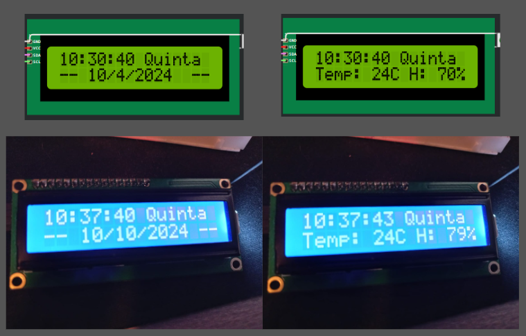
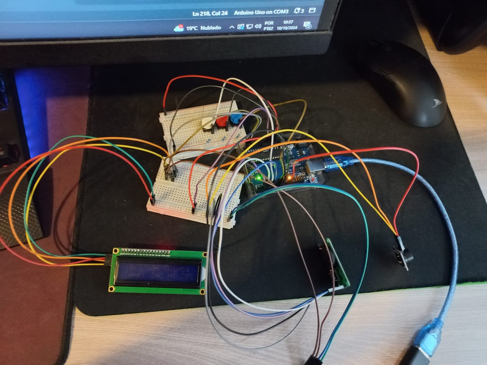

# Meu relogio

## Índice
1. [Ideia inicial](#Ideia_inicial)
2. [Requisitos/Funcionalidades](#Funcionalidades)
3. [Imagens](#imagens)
4. [Peças](#peças)
5. [Relato de Experiência](#DesenvolvimentodoProjeto)
5. [ideias de melhorias](#melhorias)
6. [Créditos](#Créditos)

## Ideia_inicial
Este projeto surgiu da minha vontade de aprender mais sobre Arduino, microcontroladores e a parte física da programação. Além disso, também vi uma oportunidade de melhorar minhas habilidades em C. Para isso, escolhi desenvolver um relógio digital, um projeto que inicialmente me pareceu de "baixa complexidade".

No começo, a ideia era simples: ler o tempo de um módulo RTC e exibi-lo em um display LCD controlado por I2C. No entanto, o projeto foi crescendo conforme meu interesse aumentava. Decidi adicionar a funcionalidade de despertador, o que trouxe mais desafios, como a programação da interatividade com o usuário e a montagem de um buzzer para emitir o som do alarme.

À medida que avancei, continuei expandindo o escopo do projeto. Adicionei um sensor de temperatura, tornando o relógio capaz de exibir a temperatura ambiente, também implementei uma funcionalidade para escolher músicas como toque do despertador, o que envolveu ainda mais programação e a integração de hardware adicional.

## Funcionalidades
1. **Exibir a data completa**: O relógio exibe o dia, mês e ano no display, além do horário.
2. **Monitorar e exibir temperatura e umidade**: Utiliza um sensor para medir e mostrar a temperatura ambiente e a umidade.
3. **Programação de alarmes**: Permite configurar até 2 alarmes, que podem ser programados para tocar em dias específicos.
4. **Seleção de toque do alarme**: Oferece a opção de escolher a música que será usada como toque do alarme.
5. **Configuração manual da data e hora**: O usuário pode ajustar a data e hora diretamente pelo dispositivo.
6. **Função de economia de energia**: A tela apaga automaticamente após um período de inatividade para economizar energia.

## Imagens

- **Menu**: Tela que alterna entre mostrar a data completa e a temperatura e umidade.
  

- **Configuração do Alarme**: Tela para configuração do alarme.
  

- **Configuração da Música do Alarme**: Tela para escolher a música do alarme.
  

- **Modo de Tela "Desligada"**: Tela apagada após um tempo de inatividade.
  

- **Montagem Virtual (Wokwi)**: Diagrama de montagem virtual feito no simulador Wokwi.
  

- **Montagem Física**: Foto da montagem física do projeto.
  

**Obs.**: Na montagem física, os cabos são diferentes da virtual. Eles são um verdadeiro desafio para organizar!

## Peças

1. **Arduino Uno**
2. **Display LCD 16x2** com módulo I2C
3. **Buzzer** ou módulo buzzer
4. **RTC DS1302**
5. **Sensor AHT10** com módulo I2C
6. **3 Push Buttons**
7. **3 Resistores de 10KΩ** para o 
8. **Vários fios** para conexões
9. **Protoboard**

## DesenvolvimentodoProjeto

### 1. Desenvolvimento
Como mencionado anteriormente na minha [ideia inicial](#ideia-inicial), utilizei a **Arduino IDE** para escrever o programa. Inicialmente, testei no **Tinkercad** e, em seguida, migrei para o **Wokwi** para simulações e testes físicos. Para aprofundar meus conhecimentos em eletrônica, assisti a um curso no YouTube e consultei vídeos isolados sobre bibliotecas para o RTC e o AHT10, além de utilizar o ChatGPT para esclarecer dúvidas específicas.

Além disso, usei o **Excalidraw** para ajudar a projetar as telas e outras partes do sistema, permitindo uma visualização mais clara da interface do usuário e facilitando a organização das funcionalidades.

### 2. Desafios da Montagem
A montagem física não foi um grande desafio, pois era difícil errar significativamente. O máximo que poderia acontecer seria não funcionar, já que todos os componentes operam com 5V, que é o que o Arduino fornece. Além disso, fiz um curso básico de eletrônica no YouTube que abordou conceitos fundamentais de eletronica e eletrica. A parte mais desafiadora foi aprender a soldar, pois meu módulo de temperatura veio sem os pinos soldados e precisei solda-los.

### 3. Desafios da Programação
Em geral, a programação também não foi desafiadora, pois usei principalmente C, que já conhecia, e C++ para criar as classes, o que era relativamente simples. A parte relacionada a arquivos `.h` e `.cpp` aprendi durante a implementação. O restante, como ler sensores e escrever no LCD, foi simples devido à abundância de exemplos e bibliotecas disponíveis na internet. O maior desafio foi desenvolver o sistema de interação com o usuário, todas as telas e inputs forneciados por ele.

### 4. Lições Aprendidas
Melhorei consideravelmente minhas habilidades em C, pois pratiquei bastante e utilizei muitos ponteiros e estruturas de dados básicas. Além disso, aprendi conceitos fundamentais de eletrônica.

### 5. Resultados Finais
Apesar de ter aprendido muitas coisas e ter conseguido implementar o projeto, o resultado final apresentou problemas que classificaria como de hardware. O principal deles foi a tela LCD, que frequentemente perdia contraste, especialmente quando o Arduino era alimentado com 9V em vez de pela entrada USB. Acredito que isso ocorreu devido à insuficiência de amperagem, mas não tenho certeza. Testei o resultado final por um curto período, pois já ia testando cada parte enquanto construía.

## melhorias

Durante o desenvolvimento do projeto, tive várias ideias de funcionalidades que poderiam ser interessantes de implementar:

1. **Transições de Tela Suaves e Efeitos de Texto**: Adicionar transições suaves entre as telas e efeitos de texto para melhorar a experiência do usuário.
   
2. **Adicionar Mais Músicas**: Incluir uma variedade maior de músicas para os alarmes, proporcionando ao usuário mais opções de personalização.

3. **Integração com IoT**: Uma ideia mais complexa que considerei foi transformar o relógio em um dispositivo IoT, permitindo a sincronização dos despertadores com os do celular do usuário. Isso permitiria que o usuário programasse alarmes diretamente no celular, e o relógio os sincronizaria automaticamente.

## Créditos

Agradeço a todas as bibliotecas e ferramentas que me ajudaram a poupar tempo durante o desenvolvimento do projeto:

- **Bibliotecas Principais**:
  - `#include <Arduino.h>`
  - `#include <LiquidCrystal_I2C.h>`
  - `#include <Adafruit_AHTX0.h>`
  - `#include <virtuabotixRTC.h>`
  - `#include <EEPROM.h>`
  - `#include <Wire.h>`

- **Músicas**: Para a parte musical do projeto, utilizei músicas de um repositório do GitHub que contém uma coleção extensa de músicas para Arduino: [Arduino Songs](https://github.com/robsoncouto/arduino-songs).

Agradeço a todos os desenvolvedores que contribuíram com essas bibliotecas e recursos, tornando o aprendizado e a implementação muito mais acessíveis!

